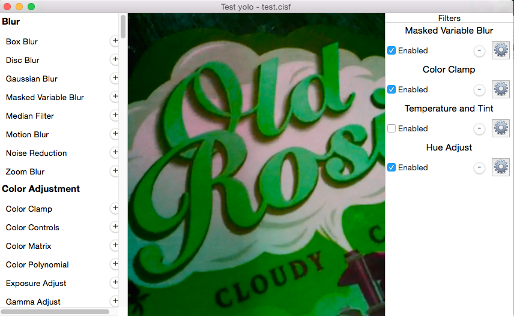

Core Image Shop
===============

Mac app that let you create a complete Core Image Filter usable on iOS using SCRecorder. 

Compiled app available on https://s3.amazonaws.com/ever-hosting/CoreImageShop.zip (Mac OSX 10.9 64 bits)

How does it work?
-----------------

- Drag and drop your image or video to the content part.
- Add your filters in the filter menu
- Configure your Core Image Filters like you want them
- Save the project into a cisf file
- Import the project in the SCRecorder on one of the relevant classes (SCAssetExportSession or SCVideoConfiguration) using

  relevantClassInstance.filter = [SCFilter filterWithContentsOfURL:urlToYourProject];

